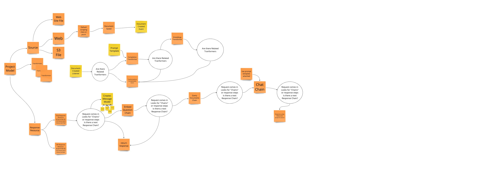

# LaraChain

## Reading over LangChain

[LaraChain.io](https://github.com/alnutile/larachain/wiki/LaraChain)

And just thinking how to make some of those flows work in a Laravel environment

[https://github.com/hwchase17/langchain](https://github.com/hwchase17/langchain)


> I am still researching terminology and patterns used by LangChain 
> will update below once I get more info and make the plugin system clear 
> which will just use composer to plugin actions etc



## Links

The PHP Vector library

https://github.com/pgvector/pgvector-php

## Setup

> Make sure to have .env in place before running `sail up`

Follow the Sail Laravel docs eg `sail up` for Postgres only the rest is just 
normal Laravel. The brew install did not work on my M2

Seed the user:

Update your `.env` file:

```dotenv
ADMIN_EMAIL=foo@bar.com
ADMIN_PASSWORD=foobaz
```

This just helps since Jetstream requires a team etc to work.


```bash
sail artisan migrate
sail artisan db:seed --class=UserSeeder
```


## Migration Note

```php 
$table->integer('token_count');
$table->vector('embedding', 1536)->nullable(); 
```

## More Logging 

```bash 
php artisan feature:on database larachain_logging
```


